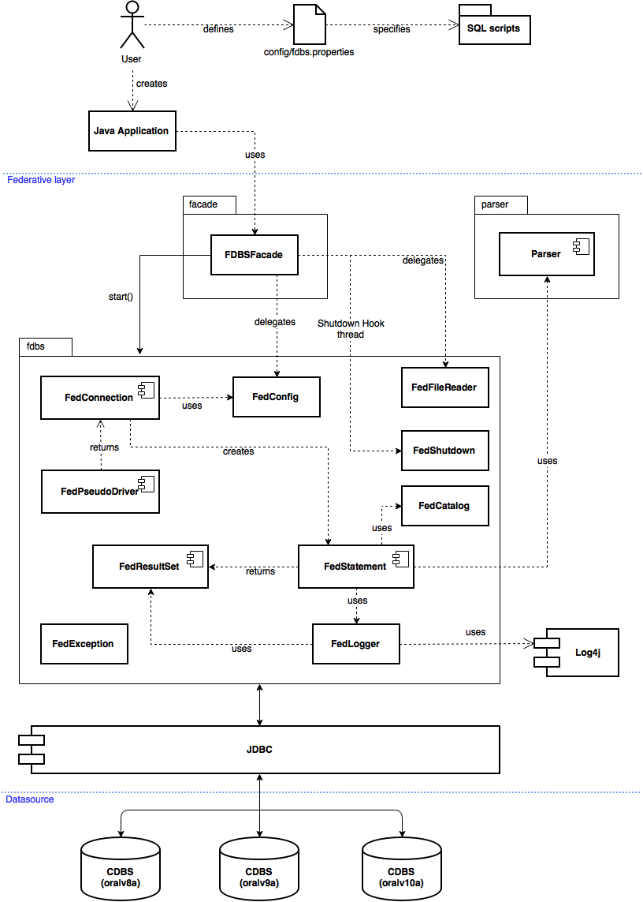
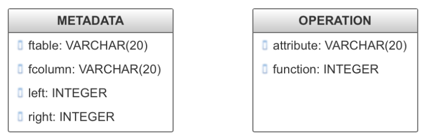

## Partial implementation of a Federative Database System (FDBS)

Implementation of a Federative Database System based on a set of homogenous Centralized Database Systems (CDBS Oracle instances), and the implementation of a simple SQL parser. Everything was developed using Java.

## Requirements

Background information, description of the tasks in detail and the functionality of the FDBS layer to be implemented are specified in the document that is released together with this report [AssignmentGP4_V7.docx](doc/AssignmentGP4_V7.docx).

Essential subtasks of the FDBS, among others, are:
- Syntax analysis of SQL statements
- Log of the processed statements
- A Federative DB catalogue (management of the distribution schema)
- Query analysis and query distribution
- Result set management

## Design and Architecture
The architecture of the system is depicted in Figure 1 and briefly presents the principal interaction among a Java application invoking the Federative layer through its facade.


> Figure 1: FDBS architecture and principal components interactions

The Federative layer uses the JDBC API to access the three CDBS and the Log4j API to log the processed statements and other messages to a file and system console.

The (domain) names of the database servers are:
- pinatubo.informatik.hs-fulda.de (oralv8a)
- mtsthelens.informatik.hs-fulda.de (oralv9a)
- krakatau.informatik.hs-fulda.de (oralv10a)


A parser is required to analyze one or more SQL statements provided by the user into logical syntactic components, and thus to validate conformability to the logical grammar specified in the requirements. To accelerate the implementation of the parser, **[JavaCC (Java Compiler Compiler)](http://javacc.org/)** was chosen.

To manage the distribution schema (Federative DB catalogue) one table is being created (Figure 2 left) on the main database together with other table (Figure 2 right) that is used for the aggregate functions.


> Figure 2: Federative DB required tables


## Implementation

Grammatical rules were provided which are to be implemented for the SQL primary language statements. The provided document [AssignmentGP4_V7.docx](doc/AssignmentGP4_V7.docx) has all the grammar rules of the assignment. Those rules have been implemented using JavaCC and are defined according to the given syntax.

The minimal subset of SQL statements that the FDBS Parser is able to handle are: Data Definition Language (DDL), Data Manipulation Language (DML), Transaction Control Language (TCL) and Query Language (QL).

###### DDL
- CREATE TABLE. Involves two types of tables, partitioned and non-partitioned. The partitioned tables are created using BNF format specified in the assignment task. The partitioning of the tables is done using HORIZONTAL keyword and specifying the list of boundaries as its attributes.
- DROP TABLE. Since this statement was not critical, a simple DROP structure was followed to implement it.


###### DML
- INSERT. Single tuple insertion is implemented in this project. Tuples are inserted to partitioned or non-partitioned.
- DELETE. Two types of DELETE statements are implemented for this project:  i.e. Conditional and unconditional.
- UPDATE. Update of tuples is implemented. When a value of a tuple is updated and this value defines on which database the tuple shall be stored, the tuple gets moved accordingly. 


###### QL
The SELECT statement was the most difficult part of the implementation. Select queries could be performed on either a single database instance at a time or all at once. Dynamic query capabilities such applying conditions, aggregate functions, and most importantly allowing the possibility of joining two tables while executing a SELECT query were made possible.

###### TCL
COMMIT and ROLLBACK commands were the only two implemented in the project.

And last but not least, the command SET ECHO [ON|OFF] was implemented to enable/disable the logger levels.


## Components

The components of the system are detailed below.

###### Federative SQL Parser

A text file with extension .jj (e.g. filename.jj) contains the whole program which is then processed to be parsed by JavaCC, which compiles the text file and generate seven other Java classes (the whole parser):

- **ParseException** and **TokenMgrError**. Used for errors detected by the parser. Subclass of Exception and hence of  Throwable.
- **Token** is a class representing tokens. Each Token object has an integer field kind that represents the kind of the token (PLUS, NUMBER or EOF) and a String field.
- **SimpleCharStream**. An adapter class that delivers characters to the lexical analyzer.
- **{filename}Constants**. An interface that defines a number of classes used in both the lexical analyzer and the parser.
- **{filename}TokenManager**. The lexical analyzer.
- **{filename}** is the parser.


{filename} is to be replaced by the name of the .jj file, in this case the main class is Parser.java. This file contains the default constructors generated by JavaCC and they receive a Stream with the statements to be parsed, e.g. a FileInputStream. An additional constructor was defined to evaluate a single statement as a String.

###### FDBSFacade

The main entry point of the system and it implements the Facade design pattern. A user writing a java application only has to define the configuration properties file (see FedConfig) and the directory containing all the SQL scripts to be executed. This component provides the method start as depicted on Figure 1 and the flow is as follows:

1. FedConfig loads the properties and sets the system configuration.
2. Prepares a list containing the file names of the SQL scripts to be executed.
3. FedConnection connects to the three databases.
4. A FedStatement object is returned by FedConnection.

5. FedFileReader gets all the statements from a SQL file.
6. FedStatement executes each statement by calling the polymorphic method execute:
If it is a comment, FedLogger logs it
If it is a SET ECHO command, FedLogger enabled or disable the logs
If the statement is to be validated, Parser does it
If it is a SELECT, calls the executeQuery method
Otherwise, calls the executeUpdate method
7. An Object is returned by FedStatement after the execution of the statement.
If the Object is instance of Integer, FedLogger displays the number of deleted rows, updated rows, etc.
If the Object is instance of FedResultSet, FedLogger calls the method printFedResults and logs the results of a QL statement.

8. Steps 5 to 7 are repeated for each SQL file contained in the list (step 2).
9. If there occurs an exception, FedException, ParseException and others are handled.
10. Just before the program terminates, FedShutdown is called to drop temporal tables.

###### FedCatalog

It defines the names of the METADATA and OPERATION tables, and provides methods to create them (if not yet created). It also provides a method to drop all the temporal tables used on the distributed joins.

###### FedConfig

It contains the information of the databases used on the FDBS and loads the default properties file (config/fdbs.properties) that stores the configurable parameters of  the FDBS as shown below:

```bash
# Databases User Credentials
user=USER123
passwd=ABCXYZ7

# Databases URL of the form jdbc:subprotocol:subname
db1=jdbc:oracle:thin:@mtsthelens.informatik.hs-fulda.de:1521:oralv9a
db2=jdbc:oracle:thin:@pinatubo.informatik.hs-fulda.de:1521:oralv8a
db3=jdbc:oracle:thin:@krakatau.informatik.hs-fulda.de:1521:oralv10a

# Directory containing the SQL scripts to be executed
# All files shall be sorted in the desired execution order
scripts=scripts/first_test

# Number of rows that should be fetched by the Statement (JDBC)
fetchsize=50000

# Parser check before executing the statements
validate=true

# Name of the log file
logfile=fdbs.txt
```

###### FedLogger

It implements the Singleton design pattern to have the logger available at anytime from anywhere. It is used to log trace, info and error messages to the system console and to a file (name specified in the properties or fdbs.log if non provided). Additionally, the log level debug is used on a method to log the results of a FedResultSet object created by the execution of a query. This component uses the Log4j2 API and it is configured in the log4j2.xml resource file. The console output will display different log levels: Info (dark green), Trace (light green / yellow), Error (red) and Debug (black).

Each log level outputs the time of the logging event up to a granularity of milliseconds. Messages for the levels Trace, Error and Debug are logged automatically by the FDBS while evaluating the statements contained in an SQL script file, and additionally the user can provide Info messages to be logged by using comments in the script file. The text to be logged must be placed between double square brackets. The Info messages shown in Figure 3 are written in the following way:
```
/* [[CHECK MEILEN > 0]] */
/* [[CHECK PREIS NOT NULL]] */
```
**Note**: in order to see the log levels with colors while working with Eclipse IDE, the plug-in Ansi Console is required.

###### FedFileReader

This component reads SQL statements from a specified script file, removes all the comments (single line and multiline) but keeps the Log Info messages, and returns the statements contained in a List object.

###### FedException

Custom Exception of the FDBS. It creates a FedException object that receives a SQLException object created at runtime, e.g., when trying to drop a table that doesn’t exist. The FedException constructor calls its parent with a custom message providing the vendor-specific exception code for this SQLException object.

###### FedShutdown

It implements the Runnable interface. A thread is created by FDBSFacade and added to the ShutdownHook. This thread will be executed when the Java Virtual Machine (JVM) is shutting down. This component calls the method to drop all the temporal tables.

###### FedShutdown

This component creates and returns a FedConnection object that establishes the connections to the three databases with the user credentials specified in the configuration file fjdbc.properties. It also provides a method to specify different credentials if needed.

###### FedConnection

It works similar to a JDBC Connection class by aggregating three of them to hold the connections to the three databases. It also aggregates a FedStatement object that is returned with the method getStatement. Once created, it connects to the databases.  

###### FedStatement

It works similar to a JDBC Statement class by aggregating three of them. Once created (within the FedConnection constructor), it creates three Statement object from each of the database connections.

It provides a polymorphic execute method to call executeQuery or executeUpdate based on the SQL statement/command received as a parameter. It validates the statement if the parser validation is activated in the configuration properties. It also calls the FedLogger if the statement is a logger-comment or a SET ECHO command.

Additionally, it provides a method to set the number of rows that should be fetched from the databases when more rows are needed for FedResultSet objects generated by this FedStatement. Particularly useful when working with big tables that contain thousands or millions of tuples.

###### FedResultSet

It works similar to a JDBC ResultSet class by aggregating three of them. It provides a polymorphic getValue method to call getString or getInt methods based on the column type.

## Release

The software is released under MIT license. A zip file is provided containing the following directories/files:

- config/fdbs.properties
- doc/AssignmentGP4_V7.docx
- lib/
log4j-api-2.7.jar
log4j-core-2.7.jar
ojdbc6.jar
- scripts/
all the tested SQL scripts sorted by filename (starting with numbers)
- src/
Java classes of the implementation
- fdbs-test.jar
- LICENSE

To test it, open a console/terminal, navigate to the project directory and run the command `java -jar fdbs-test.jar `

To test in Eclipse or other IDE:
- Create a Java project
- Configure the three provided jar files (lib)
- Configure the config/fdbs.properties file
- Create a folder to contain the SQL scripts sorted by filename
- Optionally
    - configure the fdbs-test.jar as a library or
    - copy the source code into the project
- Create a Java class with a main method and call the FDBS start method `new FDBSFacade().start();`
- That’s it.


## Author

- [Manasés Jesús](https://github.com/manasesjesus/)

## License

This project is licensed under the MIT License

## Acknowledgments

- Contributors of the parser: @intesar-gist, @mawunyega
